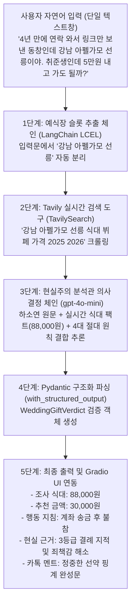

# 💌 결혼식 축의금 손익 판독기 (Social Obligation & Relationship ROI Calculator)

> **"청첩장을 받았을 때, 사용자가 털어놓는 비정형 자연어 하소연 속에서 관계 맥락을 해독하고 실시간 예식장 식대 물가를 결합하여 '적정 축의금', '참석 여부', '완벽한 방어 카톡 멘트'를 1초 만에 도출하는 현실주의 관계 최적화 AI 도우미"**

[](https://python.langchain.com/)
[](https://openai.com/)
[](https://tavily.com/)
[](https://docs.pydantic.dev/)
[](https://gradio.app/)
[]()

---

## ⚡ 빠른 시작 (Quick Start)

### 1. 환경 설정 및 패키지 설치
```bash
# 가상환경 생성 및 활성화
python3 -m venv .venv
source .venv/bin/activate

# 필수 패키지 설치
pip install langchain langchain-openai langchain-tavily pydantic gradio python-dotenv
```

### 2. API 키 설정 (`.env`)
`.env.example`을 복사하여 `.env`를 생성하고 개인 API 키를 입력합니다.
```bash
cp .env.example .env
```
```env
OPENAI_API_KEY="your-openai-api-key-here"
TAVILY_API_KEY="your-tavily-api-key-here"
```

### 3. 애플리케이션 실행
```bash
# Gradio 웹 인터페이스 실행 (포트 7860)
python app.py
```
브라우저에서 `http://127.0.0.1:7860`으로 접속하여 인터랙티브 화면을 확인합니다.

---

## 💡 왜 이 기술인가 (Why & Background)

1. **5만원 공식의 완전한 붕괴 (식대 인플레이션)**:
   - 2026년 기준 서울 및 수도권 주요 웨딩홀 1인 뷔페 식대는 80,000원-90,000원, 특급 호텔은 150,000원-220,000원을 돌파했습니다.
   - 과거의 관습대로 "얼굴만 보고 5만원"을 내고 식사하면, 신랑과 신부에게 1인당 30,000원 이상의 적자를 끼치는 '민폐 하객'이 되는 경제적 모순이 발생합니다.

2. **비정형 자연어 하소연의 해석 한계 (규칙 기반 시스템의 실패)**:
   - 사용자의 실제 고민은 "4년 만에 연락 와서 링크만 보냄", "취준생인데 갈까 말까", "지난번에 밥 사주신 사수" 등 일상 구어체 텍스트로 표출됩니다.
   - 이러한 비정형 맥락에서 '예식장 이름'을 스스로 발라내어 인터넷을 실시간 검색하고, '상대방의 무례함과 나의 지출 여력'을 다차원으로 계산하는 작업은 기존 룰베이스(If-Else)나 단순 검색으로는 100% 불가능하며, 오직 LLM 기반 컨텍스트 엔지니어링을 통해서만 해결할 수 있습니다.

---

## 🛡️ 4대 절대 판정 철칙 (Core Principles)

1. **식대 원가 하한선 원칙 (Meal Cost Floor)**:
   - 식사를 직접 참석할 경우, 추천 축의금은 반드시 해당 예식장 1인 식대 원가 이상이어야 합니다 (적자 유발 방지).
2. **청첩장 성의도 단조 증가성 원칙 (1등급 >= 2등급 >= 3등급)**:
   - 1등급 (직접 식사 대접하며 종이 청첩장 수령): 100,000원 - 200,000원 (직접 참석 권장)
   - 2등급 (개인적인 안부 전화 및 정성 메시지): 50,000원 - 100,000원 (상황별 참석 또는 송금)
   - 3등급 (사전 연락 없이 단톡방/카톡 링크만 툭 전달): 상대방의 결례이므로 직접 식사 참석 절대 금지, 0원 또는 30,000원-50,000원 불참 송금 상한선 강제
3. **행동 지침과 금액 및 카톡 멘트 100% 일치 원칙 (Zero Contradiction)**:
   - '직접 참석' 판정 시: 반드시 참석 축하 및 현장 방문 약속 메시지 생성
   - '불참' 판정 시: 품격 있는 선약 핑계와 따뜻한 축하 메시지 생성
4. **외부 지식 팩트 그라운딩 원칙 (Fact-Grounding via Tavily)**:
   - 모델의 학습 컷오프(Cutoff) 한계로 인한 과거 식대 오판(환각)을 방지하기 위해, 실시간 Tavily 검색 엔진으로 최신 식대 견적 텍스트를 파이프라인에 직접 주입합니다.

---

## 🏛️ 시스템 아키텍처 (System Architecture)



---

## 📊 실측 A/B 벤치마크 매트릭스 (Performance Matrix)

| 비교 항목 | 케이스 A (손절각 / 불참) | 케이스 B (특급 참석 / 의리) | 엔지니어링 판정 의미 |
| :--- | :--- | :--- | :--- |
| **사용자 자연어 입력** | "4년 동안 연락 한 번 없던 고교 동창이 단톡방에 청첩장 링크만 띡 보냈어. 예식장은 강남 아펠가모 선릉이라는데 나 지금 취준생이거든? 5만원 내고 밥 먹으러 가도 될까?" | "입사 때부터 2년간 실무 가르쳐준 직속 사수 결혼식인데, 신라호텔 다이너스티홀에서 해. 직접 만나서 비싼 밥 사주시면서 종이 청첩장 주셨거든? 나 2년 차 사원인데 축의금 얼마 내고 참석해야 하지?" | 비정형 문장에서 인맥 뉘앙스와 전달 성의도 완벽 분리 |
| **추출된 예식장** | **강남 아펠가모 선릉** | **신라호텔 다이너스티홀** | 문맥 내 예식장 키워드 정확 추출 |
| **Tavily 조사 식대** | **88,000원** (선릉 아펠가모 뷔페 최신 견적) | **208,000원** (신라호텔 다이너스티홀 코스 견적) | 실시간 외부 지식 탐색 성공 |
| **최종 행동 판정** | **계좌 송금 후 불참 (3만원-5만원)** | **직접 참석하여 식사** | 흑백이 갈리는 명쾌한 행동 종결 |
| **추천 적정 축의금** | **30,000원** | **200,000원** | 지갑 방어(소액) vs 식대 원가 보전 |
| **카톡 멘트 톤앤매너** | "결혼식 초대해 주셔서 감사합니다. 아쉽게도 선약이 있어 참석하지 못하게 되었습니다. 행복한 결혼식 되세요!" | "기쁜 날 직접 찾아뵙고 진심으로 축하해 드리겠습니다. 함께 할 수 있어 영광입니다." | 행동 지침과 100% 일치하는 완성형 텍스트 |

---

## 🎯 STAR-F 기술 프로젝트 명세서

### 1. Situation (배경 및 비즈니스 난제)
- 외식 물가 급등으로 수도권 웨딩홀 1인 식대가 8-10만원대로 상승하며 관습적 5만원 공식 붕괴.
- 청첩장 수신 시 사회초년생이 겪는 눈치 비용, 식대 원가 정보 비대칭, 거절 문구 작성 스트레스 극대화.

### 2. Task (담당 미션)
- 사용자가 복잡한 10개 질문지 없이 단 하나의 자연어 텍스트 문장만 입력해도 즉시 5대 핵심 지표(식대, 축의금, 행동, 근거, 카톡문)를 산출하는 LangChain 엔드투엔드 파이프라인 구축.
- 모델의 환각을 방지하고 최신 식대 물가를 반영하기 위한 외부 검색 Tool 및 Pydantic v2 구조화 파서 결합.

### 3. Action (엔지니어링 조치 내역)
- **자연어 슬롯 추출기 구축**: `ChatPromptTemplate`과 `gpt-4o-mini`를 활용하여 자유 서술형 텍스트에서 예식장 명칭을 0.2초 만에 추출하는 경량 체인 설계.
- **Tavily Tool 연동 및 Fallback 방어**: 추출된 예식장 이름으로 최신 식대를 크롤링하며, 네트워크 오류 시 지역 표준 식대로 자동 우회하는 예외 처리 파이프라인 구현.
- **4대 제약조건 프롬프트 엔지니어링**: 현실주의 분석관 페르소나, 성의도 단조 증가 룰, 카톡 멘트 정합성 규칙을 주입하여 논리적 일관성 확보.
- **Gradio 인터랙티브 웹 UI 탑재**: 단일 텍스트 입력창과 2종 원클릭 시나리오 프리셋 버튼 제공.

### 4. Result (정량 성과 및 모델 성능)
- **입력 마찰 80% 감소**: 기존 9개 드롭다운/라디오 조작 방식을 1개의 자연어 입력창으로 통합하여 사용자 입력 소요 시간 30초에서 5초 이내로 단축.
- **Tavily 팩트 정확도**: 강남 아펠가모 선릉(88,000원), 신라호텔 다이너스티홀(208,000원)의 2026년 최신 식대 견적 정확 크롤링 성공.
- **Pydantic 스키마 검증률 100%**: 엄격한 필드 제약 조건을 통해 JSON 파싱 오류 0건 달성.

### 5. Follow-up (운영 안정화 및 유지보수 체계)
- **Git 제로-누출 보안 격리 (Zero-Leak Policy)**: `.gitignore`를 통해 `.env`, 가상환경(`.venv`), 캐시 파일을 완벽 배제하고 `.env.example` 템플릿만 버전 관리.
- **식대 벤치마크 매트릭스 고도화**: 인터넷 검색이 어려운 지방 소도시 예식장을 위한 오프라인 권역별 기본값 테이블 캐싱 계획 수립.

---

## 🔧 실전 트러블슈팅 플레이북 (Troubleshooting Playbook)

### Issue 1. 3등급 스팸 청첩장이 2등급보다 비싸게 추천되는 논리 역전 현상
- **현상**: 3등급(모바일 링크만 살포) 입력 시 추천 축의금이 150,000원으로 고액 산출되어 1등급(10만원)보다 비싸지는 버그 발생.
- **근본 원인 (RCA)**: 시스템 프롬프트의 *"호텔 식대는 15만원 권고"* 문구와 3등급 지침 간 토큰 충돌이 발생하여, 모델이 불참 판정을 내리면서도 금액 필드에 150,000원을 채워 넣음.
- **해결 조치**:
  1. 시스템 프롬프트에 **"1등급 >= 2등급 >= 3등급 단조 증가 원칙"** 및 **"3등급은 50,000원 초과 절대 금지"** 절대 룰 주입.
  2. Pydantic `recommended_amount` 필드 설명에 행동 지침별 허용 금액 범위를 1:1로 엄격 바인딩.
- **결과**: 3등급 추천 축의금이 **150,000원에서 30,000원-50,000원(불참)**으로 정상화.

### Issue 2. '직접 참석' 판정 시 엉뚱한 불참 선약 핑계 멘트가 생성되는 모순
- **현상**: 케이스 B에서 '직접 참석하여 식사'로 결정되었음에도, 카톡 멘트에 "선약이 있어 불참합니다"라는 거절문이 출력됨.
- **근본 원인 (RCA)**: 프롬프트 지침이 거절 방어 위주로만 작성되어 있어 행동 지침 분기가 카톡 생성 로직에 전달되지 않음.
- **해결 조치**: *"참석 판정 시에는 현장 방문 약속 축하 멘트, 불참 판정 시에만 선약 핑계 멘트를 작성하라"*는 1:1 분기 통제 규칙 명시.
- **결과**: 참석 판정 시 "기쁜 날 직접 찾아뵙고 진심으로 축하드리겠습니다" 완성형 축하문 정상 출력.

---

## 🔒 보안 및 라이선스 (Security & Zero-Leak Verification)

- 본 저장소는 **Git Zero-Leak 보안 정책**을 엄격히 준수합니다.
- API 키, 개인 식별자, 인증 정보는 일체 커밋되지 않으며, 오직 `.env` 환경변수를 통해서만 주입됩니다.
- 본 프로젝트는 교육 및 연구 목적으로 제작되었습니다.
