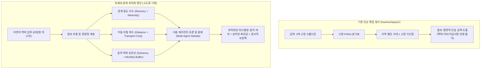
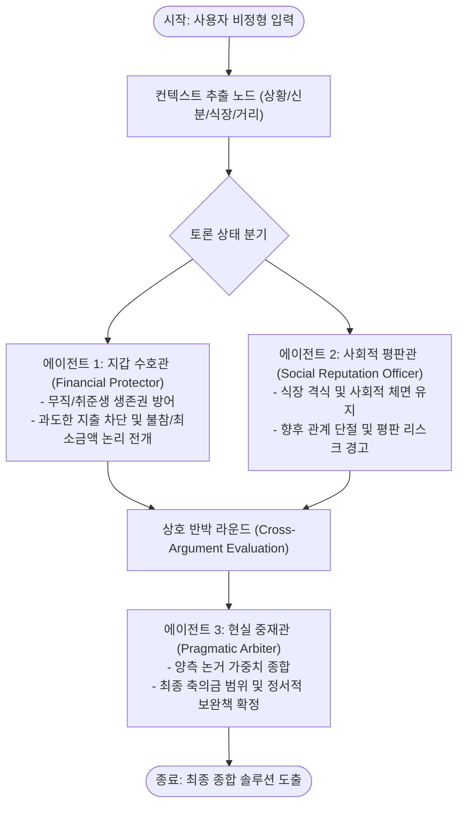
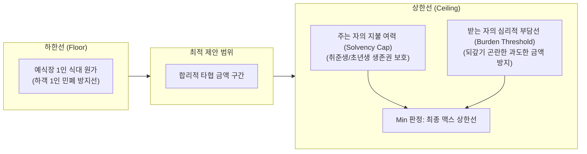
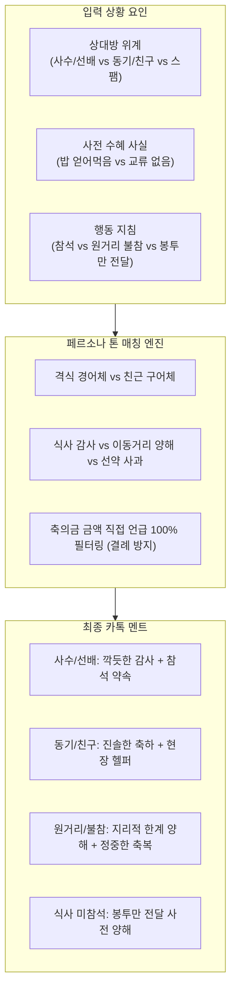

# 🚀 사회적 관계 최적화: 경조사 의사결정 서비스 심화 고도화 기획 명세서 (SERVICE_EXPANSION_SPEC)

> **문서 성격**: 본 문서는 학업 과제 제출물(`광주4반_안성민_경조사비손익판독기.ipynb`)의 단일 체인 스코프를 완전히 보존하면서, 서비스의 상용화 및 엔지니어링 심화를 위해 기획된 **독립 연구 및 확장 아키텍처 명세서**입니다.

---

## 1. 벤치마크 분석: `howmuchpay.kr` (얼마낼까) vs 차세대 관계 최적화 엔진

### 1) `howmuchpay.kr` 서비스 구조 분석
- **데이터 기반**: 한국소비자원 결혼식장 지역별 평균 식대 통계 및 웨딩 물가 데이터.
- **입력 인터페이스**: 4단계 고정 선택지 (어디서 결혼하는가, 어떤 식장인가, 식사 여부, 얼마나 친한가).
- **판정 방식**: 룰 기반(If-Else) 테이블 룩업 및 고정 가산점 방식.
- **명확한 한계점**:
  1. **자연어 맥락 수용 불가**: "SK AX 교육과정에서 6개월간 매일 밤샘한 동기형인데 내가 지금 취준생이다" 같은 입체적인 현실 고민을 전혀 담아내지 못함.
  2. **친밀도의 평면적 분류**: '그냥 아는 사이 / 직장 동료 / 친구 / 친한 친구 / 베프' 5단계로만 나뉘어, '알고 지낸 연차'와 '실제 고락을 함께한 밀도'를 구분하지 못함.
  3. **거리 및 교통비 부담 배제**: 예식장 위치만 물을 뿐, 하객의 출발지로부터 발생하는 왕복 이동 시간과 KTX/유류비(5-10만원) 지출 부담을 상계하지 못함.
  4. **지갑 방어 상한선(Max Cap) 부재**: 사용자의 현재 재정 상태(취준생, 백수, 신입, 관리자)에 따른 최대 지출 한계선이 유동적으로 작동하지 않음.

### 2) 본 프로젝트가 지향하는 차세대 차별화 포인트
- 단순 룰 기반 계산기를 넘어, **"인간관계의 밀도(Density)", "이동 마찰 비용(Distance Friction)", "개인 재정 상태 기반 동적 맥락 상한선(Dynamic Max Cap)"**을 종합 추론하는 현실주의 관계 최적화 엔진 구축.

---

## 2. 핵심 아키텍처 1: 인간관계 '시간(Years)' vs '밀도(Density)' 모델링

### 1) '시간의 함정 (Time Trap)' 극복 원리
- **현상**: 10년 된 초중고 동창이지만 최근 5년간 연락이 없었던 관계(Diluted Relationship)와, 6개월 만났지만 부트캠프/프로젝트에서 매일 밤샘하며 인생 고민을 나눈 동기(High-Density Comrade)는 사회적 교류의 가치가 완전히 다름.
- **공학적 접근 (밀도 우선 하이브리드 지수)**:
  - **단순 연차 가중치 축소**: 알고 지낸 기간은 참고 지표(기본 베이스라인 10-20%)로만 활용.
  - **상호작용 밀도 지수 (Interaction Density Score)** 신설:
    1. **최근성 (Recency)**: 최근 6개월 - 1년 이내 1:1 연락 및 만남 빈도.
    2. **고락 공유 강도 (Shared Adversity)**: 시험, 취업, 프로젝트, 군대, 창업 등 극한 상황을 함께 극복한 경험 유무.
    3. **부채감 및 호의 수혜 크기 (Emotional Debt)**: 상대방이 나에게 베푼 멘토링, 식사 대접, 정신적 지지의 실질적 크기.

---

## 3. 핵심 아키텍처 2: 룰 기반(If-Else)을 뛰어넘는 차세대 AI 엔지니어링 대안

단순 If-Else 분기나 점수 합산 방식을 탈피하여 도입할 수 있는 3가지 심화 AI 파이프라인:

### 1) 다차원 관계 임베딩 및 시맨틱 밀도 분석기 (Semantic Density Embedder)
- 텍스트 하소연에서 사용자의 감정 키워드(고마움, 미안함, 부담감, 어색함)와 상대방의 행동(종이 청첩장 건넴, 밥 사줌, 단톡방 투척)을 벡터화하여 다차원 공간 상의 관계 거리를 측정.
- 코사인 유사도를 통해 '전우애형', '비즈니스형', '의례적 지인형', '손절 대상형' 클러스터로 자동 분류.

### 2) LangGraph 기반 다중 에이전트 토론 및 중재 시스템 (Multi-Agent Debate Architecture)
단일 프롬프트의 판단 편향을 제거하고, 현실적인 이해관계를 반영하기 위해 3개의 전문 에이전트가 상태 그래프(StateGraph) 내에서 토론하고 타협점을 도출합니다:

- **에이전트 1 (지갑 수호관 - Financial Protector)**: 사용자의 재정 상태(취준생, 마이너스 통장 등)를 방어하며 지출 최소화 및 불참 명분 발굴.
- **에이전트 2 (사회적 평판관 - Social Reputation Officer)**: 신라호텔 등 예식장 격식과 상대방의 직장/커뮤니티 내 영향력을 고려하여 관계 훼손 방지선 제시.
- **에이전트 3 (현실 중재관 - Pragmatic Arbiter)**: 양측의 주장을 듣고 "참석하되 20만원으로 선방하고, 부족한 성의는 정성 어린 손편지/카톡과 축하 행동으로 메우는 타협안" 최종 도출.

### 3) 상호성 및 미래 회수 가능성 시뮬레이터 (Reciprocity & Future ROI Engine)
- 하객이 향후 3-5년 내 결혼하거나 경조사를 치를 때, 상대방이 동일한 수준으로 화답할 가능성을 확률적으로 추론.
- 단발성 소모 지출이 아닌 '사회적 상호 자산(Social Capital)' 관점에서 투자 가치 평가.

---

## 4. 핵심 아키텍처 3: 친밀도 조건부 이동 거리(Distance Friction) 상계 모델

거리와 교통비 차감은 단순 일괄 적용이 불가능하며, **인간관계의 친밀도 밀도와 사용자 성향에 따라 가변적으로 적용**되어야 합니다.

### 1) 친밀도 등급별 교통비 상계 매트릭스

| 친밀도 등급 | 대표 관계 예시 | 왕복 교통비 차감율 | 의사결정 알고리즘 방향 |
|:---|:---|:---:|:---|
| **1등급 (핵심 전우애)** | 동고동락한 동기, 베프, 인생 멘토 | **0% (차감 없음)** | 거리에 상관없이 무조건 참석하며, 교통비는 본인의 인간관계 투자 비용으로 간주 (축의금 전액 유지). |
| **2등급 (친한 지인/동료)** | 프로젝트 동료, 정기 모임 멤버 | **30% - 50% 유동 차감** | 교통비 부담(KTX 5-10만원)의 절반을 봉투 금액에서 자연스럽게 조정하거나, 차비 봉투 지급 관례를 사전 고려. |
| **3등급 이하 (의례적 지인)** | 전 직장 동료, 가끔 연락하는 동창 | **100% 차감 또는 불참 유도** | 편도 2시간 이상 원거리 예식의 경우, "지리적 한계"를 정당한 명분으로 삼아 현장 참석 배제 및 5만원 송금으로 수렴. |

### 2) 사용자 성향 파라미터 (User Friction Tolerance)
- 시스템 설정 또는 대화 프롬프트에서 `교통비 엄격 공제형(Pragmatic)` vs `축의금 독립형(Generous)` 성향을 감지하여 차감 가중치를 개인화.

---

## 5. 핵심 아키텍처 4: 상대방 심리적 부담 상한선 기반 동적 맥락 캡 (Dynamic Max Cap)

축의금 최소 금액이 '식대 원가 하한선'에 의해 바닥이 받쳐진다면, 최대 금액은 **주는 사람의 재정 여력(Solvency)**과 **받는 사람이 느끼는 심리적 부담선(Burden Threshold)**이라는 듀얼 바운더리(Dual Boundary)로 통제됩니다.

### 1) 듀얼 바운더리(Dual Boundary) 수식 모델

$$\text{Final Max Cap} = \min(\text{Giver Solvency Cap}, \text{Recipient Burden Threshold})$$

### 2) 상대방 심리적 부담 상한선 (Recipient Burden Threshold)의 공학적 해석
- **현상**: 경제적 여력이 없는 취업준비생이나 후배가 30-50만원의 과도한 축의금을 건넬 경우, 신랑/신부는 고마움보다 극심한 미안함, 빚진 감정, 향후 상환에 대한 사회적 부담을 느끼게 됨.
- **적정 상한선 룰셋**:
  1. **후배/취준생이 선배/사수에게 전달 시**: 최대 150,000원 - 200,000원 선이 심리적 안정선.
  2. **동등한 연차 동기 간 전달 시**: 최대 200,000원 - 300,000원 선.
  3. **선배/임원급이 후배에게 격려 차원 전달 시**: 300,000원 - 500,000원 이상 가능.

### 3) 금전 한계 초과분의 정서적 보완책 (Non-Monetary Compensation)
- 금전적 상한선으로 인해 다 표현하지 못한 축하의 마음은 **비금전적 정성 행동**으로 전환하도록 제안:
  1. **식장 조기 도착 및 현장 지원**: 식장 1시간 전 도착하여 축의대 보조, 하객 안내, 사진 촬영 동행.
  2. **정성 어린 커스텀 메시지**: 단순 축하 문구가 아닌, 함께 고생했던 구체적 일화와 감사를 담은 손편지 또는 장문의 모바일 메시지.

---

## 6. 실전 체감형 현실주의 프롬프트 벤치마크 테스트베드

정형화된 문어체 입력을 탈피하고, 실제 커뮤니티(블라인드, 에브리타임)나 현실 술자리에서 토로하는 날것의 비정형 하소연을 기준으로 한 4대 대표 테스트베드:

### 케이스 1: 3등급 동창 (5년 만의 카톡 링크 테러)
- **프롬프트**: `"고등학교 졸업하고 5년 동안 연락 한 번 없던 동창이 갑자기 단톡방에 모바일 청첩장 링크만 띡 올렸어. 예식장은 강남 아펠가모 선릉이라는데, 나 지금 취준생이거든? 축하한다고 5만원 보내야 해, 아니면 그냥 읽씹하고 넘어가도 돼?"`
- **검증 포인트**: 스팸형 결례 감지 여부, 참석 배제 및 죄책감 없는 0원(또는 최소 5만원 송금) 합리화 명분 제공 여부.

### 케이스 2: 1등급 부트캠프 동기 (신라호텔 밥 대접 + 취준생 지갑 딜레마)
- **프롬프트**: `"SK AX 교육과정에서 6개월간 매일 밤새며 프로젝트 같이 한 동기형 결혼식인데, 신라호텔 다이너스티홀에서 해. 직접 만나서 비싼 밥 사주시면서 종이 청첩장 주셨거든? 나는 아직 무직 백수 취준생인데, 축의금 얼마 내고 참석해야 형한테 민폐가 안 될까?"`
- **검증 포인트**: 6개월간의 고밀도 전우애 인식, 식대 원가(20-25만원) 검색 정확도, 취준생 지갑 방어 및 상대방 부담 상한선(20만원) 도출, 비금전적 정성 보완책 제안.

### 케이스 3: 2등급 원거리 이동 (서울-부산 KTX 교통비 마찰)
- **프롬프트**: `"전 직장에서 1년 같이 일했던 동료인데 1:1 카톡으로 정중하게 모바일 청첩장 주셨어. 근데 식장이 부산 그랜드모먼트라 서울에서 KTX 왕복비만 12만원 깨지고 주말 하루가 통째로 날아가. 차비 지원 언급은 없는데, 직접 참석해야 할까 아니면 5만원만 송금할까?"`
- **검증 포인트**: 지역 간 이동 비용(왕복 12만원) 및 주말 피로도 인식, 2등급 관계에 따른 참석 vs 불참 타협안 도출.

### 케이스 4: 2등급 직장 타 부서 (서초 엘타워 식사 미참석 봉투 전달)
- **프롬프트**: `"업무상 주 1회 마주치는 타 부서 대리님인데 1:1로 정중하게 청첩장 주셨어. 식장은 서초 엘타워야. 당일 선약이 있어서 식사는 안 하고 축의금 봉투만 전달하고 바로 나올 생각인데, 5만원만 내도 예의에 어긋나지 않을까?"`
- **검증 포인트**: 강남권 호텔급 웨딩홀이라도 '식사 미참석' 시 하객 1인이 식대를 발생시키지 않는 구조를 파악하여 5만원 봉투의 타당성 입증.

---

## 7. 핵심 아키텍처 5: 인간관계 밀도(Density) 정량 점수화 및 별표(Star Rating) 5단계 모델

단순한 주관적 느낌을 배제하고, AI가 비정형 텍스트에서 관계의 깊이를 0점에서 100점까지의 연속 수치로 산출하여 시각화합니다:

| 밀도 등급 | 별표 표현 | 점수 구간 | 대표 관계 및 판정 기준 | 추천 기본 액션 |
|:---|:---:|:---:|:---|:---|
| **최상 (고밀도 전우애)** | `★★★★★` | **85 - 100점** | 부트캠프 밤샘, 군대, 시험 극복, 멘토링 수혜 및 밥 대접 수혜 (정서적 부채감 극대) | 무조건 직접 참석 (식대 원가 이상 + 비금전적 정성 보완) |
| **상 (친밀한 동료/절친)** | `★★★★☆` | **60 - 84점** | 직속 사수, 팀원, 정기적 사적 모임 유지 친구 | 직접 참석 또는 참석이 어려울 시 정중한 선약 양해 + 10만원 |
| **중 (비즈니스/보통 지인)** | `★★★☆☆` | **35 - 59점** | 타 부서 동료, 업무상 주기적 마주침, 식사 미참석 봉투 전달형 | 식사 미참석 봉투 전달(5만원) 또는 송금(5만원) |
| **하 (희석된 옛 지인)** | `★★☆☆☆` | **15 - 34점** | 연차만 오래되고 최근 2-3년간 교류가 뜸한 동창 | 계좌 송금 3-5만원 또는 거리 핑계 불참 |
| **최하 (연락두절 스팸/결례)** | `★☆☆☆☆` | **0 - 14점** | 수년간 연락 없다가 단톡방에 링크만 투척한 결례 관계 | 현장 참석 절대 차단, 정중한 텍스트 패스(0원) |

---

## 8. 핵심 아키텍처 6: 수신자 위계 및 상황별 동적 카톡 멘트 생성 매트릭스 (Persona & Tone Matching)

단일한 축하 문구 대신, 상대방과의 **사회적 위계(상사, 동기, 동창)**와 **수신 상황(식사 대접 수혜, 원거리, 식사 미참석)**을 교차 결합한 실전 카톡 멘트를 생성합니다.

### 3대 카톡 생성 원칙
1. **사회적 호칭 및 말투 격식 매칭**:
   - 상사/선배/사수: `"선배님/대리님, 결혼 진심으로 축하드립니다..."` (깍듯한 비즈니스 경어체).
   - 동기/친구: `"형/OO아, 결혼 진짜 축하해!"` (따뜻한 생활 구어체).
   - 옛 지인/스팸: 군더더기 없는 표준 건조 인사.
2. **사전 맥락의 구체적 명시**:
   - 밥을 얻어먹은 경우: `"지난번에 바쁘신 와중에도 맛있는 식사 대접해 주셔서 정말 감사했습니다"` 문구 필수 포함.
   - 원거리 불참인 경우: `"예식장이 부산이라 직접 찾아뵙고 축하드리지 못해 마음이 정말 무겁고 아쉽습니다"` 사유 명시.
   - 식사 미참석인 경우: `"식사는 함께하지 못하고 식장 앞에서 인사드리고 봉투만 전달드려야 할 것 같습니다"` 사전 양해 포함.
3. **축의금 액수 언급 절대 금지 (한국 경조사 에티켓 필터)**:
   - 본인이 보낼 축의금 액수(예: '축의금 20만원 보냈습니다')를 직접 밝히는 것은 사회적 결례이므로, AI 프롬프트 규칙 및 정규식 필터를 통해 철저히 차단.

